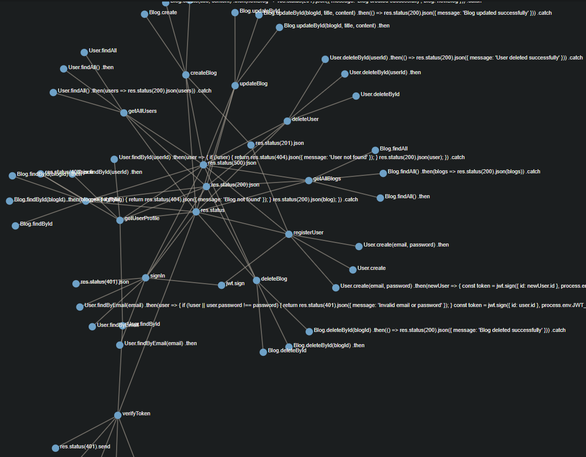
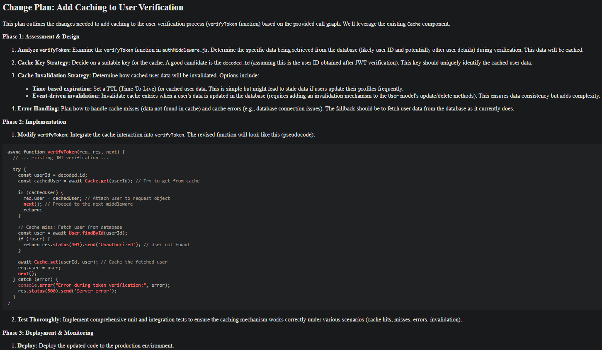

# Buddy 🚀

## Description

Buddy is your new AI friend 🤗. It has started as a project to be a `Code Buddy` i.e. It will read existing source code 👩‍💻 and allow the developers to ask questions about the code and even help in creating a `Code Change Plan`.

👉 **Note** : As of now `Buddy` only works with `JavaScript` code.

## How it works?

-   It uses `Python` 🐍
-   It uses `tree_sitter` to parse the code.
-   Then it creates a `call graph` for the code using `Networkx`.
-   It then uses `Gemini` as `LLM`.
-   It has an **intelligent** mode where it uses `LangChain` and `Chroma` to save the `Google AI Embeddings` locally to filter `call graph` for the user query before sending it to `Gemini`.
-   It uses `NLTK` for generating synonyms for function names.

## Why LangChain and Chroma?

-   LangChain and Chroma are used to save the `Google AI Embeddings` locally to filter `call graph`
-   This is done to reduce the `LLM` usage and make `Buddy` efficient.

## Setup Instructions

👉 **Note**: Python 3.12.8 or latter is required.

1. **Clone the repository:**

    ```bash
    git clone https://github.com/yadavanuj/buddy.git
    cd buddy
    ```

2. **Create a `.env` file:**

    - In the `buddy` directory, create a file named `.env`.
    - Add the following line to the `.env` file:
        ```
        GEMINI_KEY=your_gemini_key_here
        ```

3. **Install dependencies:**

    - Make sure to install any required dependencies for the project.
        ```
        .\venv\Scripts\activate
        pip install -r requirements.txt
        ```

4. **Run the application:**
    - Follow the instructions to run the application.

## Usage

-   The CLI provides two major commands
    -   code - To create change plan
    -   refresh - To refresh NLTK dependencies and/or Chroma embeddings.
-   Using `code` command :
    -   The `node_app` directory has a sample JS app.
    -   Assuming you have cloned `buddy` in `D:\buddy`
        ```
        >.\venv\Scripts\activate
        >cd .\buddy
        >python .\buddy_cli.py code
        Root folder for JS project to create change plan for.: D:\buddy\node_app
        Query to be asked about the JS code.: Add caching to user verification
        Directly send whole call graph to gemini without filtering [0]: 0
        Parse code and embed to chroma [0]: 1
        ```
-   `/buddy/viewer` directory uses `Node JS`, `D3` and `Marked` to help you visualize the output.
    -   Using viewer
        ```
        cd .\viewer
        node server.js # do an npm i first
        ```
    -   localhost:3000 shows call graph
    -   localhost:3000/plan shows code change plan

👇 Call Graph



👇 Code Change Plan



## Next

-   Refactoring
-   Testing
-   Add support for more LLMs e.g. OpenAI
-   Add support for more programming languages e.g. Python, Java, C++
-   Add support for PDF and HTML
-   Add support for flexible prompts
-   Add support for dynamic pipeline of callables to use `Buddy` differently. e.g.
    -   A teacher can use `Buddy` by indexing PDF
    -   A coder can use `Buddy` by parsing code.

## Note

-   Ensure that the `.env` file is included in your `.gitignore` to prevent it from being pushed to the repository.
